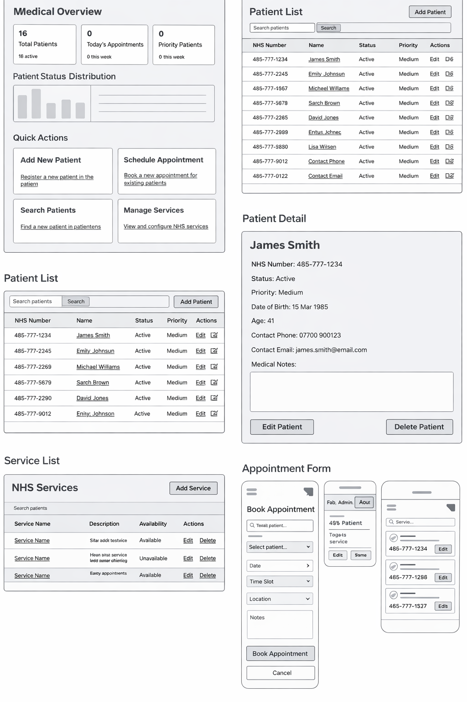
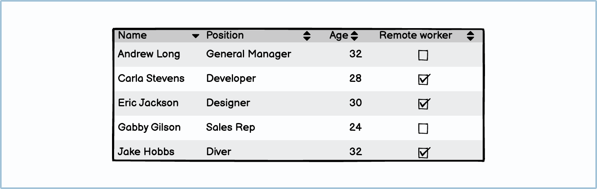

# NHS Service Tracker

[](https://nhs-service-tracker-87d657694884.herokuapp.com/login/)

A Django web application for managing NHS patients, services, and appointments. Built for healthcare teams to track care workflows, priorities, and appointments in a single, secure system.

[View the live project here.](https://nhs-service-tracker-87d657694884.herokuapp.com/login/)

## Table of Contents

- [Overview](#overview)
- [Rationale](#rationale)
- [UX](#ux)
- [Wireframes](#wireframes)
- [Features](#features)
- [Data Model](#data-model)
- [Code Snippets](#code-snippets)
- [Technologies Used](#technologies-used)
- [Testing](#testing)
- [Deployment](#deployment)
- [Security](#security)
- [Future Enhancements](#future-enhancements)
- [Credits](#credits)

## Overview

### Purpose & Value

The NHS Service Tracker provides:

- Patient management with status and priority fields
- Dashboard totals for patients, services, and appointments
- Service management
- Appointment scheduling
- Secure authentication
- Responsive NHS-style design

This project consolidates patients, services, and appointments into a single system so staff can manage care workflows without spreadsheets or disconnected notes.

## Rationale

- Clinics often rely on spreadsheets for patient lists and appointments, which makes updates inconsistent and auditing difficult.
- This app keeps core data in a relational structure so patient status and appointment history stay linked.
- The dashboard provides a quick operational snapshot to reduce time spent gathering totals.

Design decisions were focused on clarity, speed of access, and reduced risk of data entry errors.

### Requirements

- Python 3.8+
- Django 5+
- SQLite (development) or PostgreSQL (production)
- Modern web browser

### Project Structure

```plaintext
nhs_service_tracker/
├── nhs_service_tracker/          # Django project package
│   ├── settings.py              # Django settings
│   ├── urls.py                  # URL routing
│   ├── wsgi.py                  # WSGI entry point
│   └── asgi.py                  # ASGI entry point
├── tracker/                      # Django app (views, models, forms)
├── templates/                    # Django templates
├── static/                       # Static assets (CSS/JS)
├── tests/                       # Test suite
├── docs/                        # Documentation (wireframes)
├── manage.py                    # CLI commands and data seeding
├── requirements.txt             # Python dependencies
├── Procfile                     # Heroku deployment configuration
└── README.md                    # Project documentation
```

## UX

### Target Audience

- Reception/admin staff
- Clinicians
- Service managers/supervisors

### User Stories

- As a receptionist, I can create a patient record.
- As a clinician, I can update medical notes.
- As an admin, I can manage services.
- As a scheduler, I can book and manage appointments.
- As a manager, I can view workload statistics.

#### First Time Visitor Goals

- As a first time visitor, I want to understand the purpose of the system quickly.
- As a first time visitor, I want to find how to sign in or register.
- As a first time visitor, I want to see the core features before committing time.

#### Returning Visitor Goals

- As a returning visitor, I want to manage patients efficiently.
- As a returning visitor, I want to update services and appointments with minimal clicks.
- As a returning visitor, I want to confirm my previous changes persisted.

#### Frequent User Goals

- As a frequent user, I want to access key areas from the dashboard quickly.
- As a frequent user, I want to search patients by name or NHS number.
- As a frequent user, I want the UI to be consistent across devices.

### Design Principles

- Clean, scannable interface
- NHS-inspired color palette
- Clear information hierarchy
- Accessible forms and navigation
- Dashboard-first information design

### Design

#### Colour Scheme

- NHS-inspired blues with neutral backgrounds for readability.

#### Typography

- Clean, legible system fonts to prioritize clarity in clinical contexts.

#### Imagery

- Minimal imagery to keep focus on data entry and operational workflows.

## Wireframes

Wireframes were created during the planning phase to define layout, functionality, and user journeys before development began. The mockups cover:

- Dashboard statistics layout
- Patient list view
- Patient detail view
- Appointment booking form
- Service management table
- Responsive layout across devices

Wireframe notes are documented in [docs/wireframes/README.md](docs/wireframes/README.md).






- Home page wireframe: [docs/wireframes/images/patient_wf.png](docs/wireframes/images/patient_wf.png)
- Mobile wireframe: [docs/wireframes/images/cmobiframe.png](docs/wireframes/images/cmobiframe.png)

## Features

### Core Functionality

- Patient records with NHS number tracking
- Patient status and priority management
- Dashboard summary cards
- Appointment scheduling
- Service management
- Secure Django authentication
- Patient search by name or NHS number
- Responsive NHS-style UI

### Additional Features

- Calculated fields (age, next appointment)
- Confirmation step for delete actions
- Data validation and secure form handling
- Dashboard status distribution and priority badges

### Features Left to Implement

- Calendar view for appointments
- Email reminders and notifications
- Role-based access controls

## Data Model

### Patients

- NHS number (unique)
- Demographics
- Status (Active, Inactive, Discharged, Deceased)
- Priority (Low, Medium, High, Urgent)
- Medical notes
- Calculated age
- Appointment history

### Services

- Service name
- Description
- Linked appointments

### Appointments

- Linked patient
- Linked service
- Date/time
- Location
- Status
- Notes

Relationships allow:

- Dashboard summaries
- Upcoming appointment tracking
- Priority distribution analytics

### Seeded Data (Optional)

- Example services (General Practice, Cardiology, Mental Health, etc.)
- Sample patients with realistic NHS numbers and contact data
- Example appointments across past and upcoming dates

## Code Snippets

### Model Relationships

```python
class Appointment(models.Model):
	patient = models.ForeignKey(Patient, related_name="appointments", on_delete=models.CASCADE)
	service = models.ForeignKey(Service, on_delete=models.CASCADE)
	scheduled_for = models.DateTimeField()
	location = models.CharField(max_length=120)
	status = models.CharField(max_length=20, choices=STATUS_CHOICES, default="scheduled")
```

### Protected CRUD View

```python
@login_required
def patients_edit(request, pk):
	patient = get_object_or_404(Patient, pk=pk)
	form = PatientForm(request.POST or None, instance=patient)
	if request.method == "POST" and form.is_valid():
		form.save()
		messages.success(request, "Patient updated.")
		return redirect("patients_detail", pk=patient.pk)
	return render(request, "patients/form.html", {"form": form, "title": "Edit Patient"})
```

### Template Form Pattern

```html
<form method="post" novalidate>
  
  {{ form.non_field_errors }}
  {{ form.as_p }}
  <button type="submit">Save</button>
</form>
```

## Technologies Used

### Backend

- Python 3.8+
- Django 5+
- SQLite (development)
- PostgreSQL (production)
- Gunicorn

### Frontend

- HTML5
- CSS3 (custom)

### Testing & Quality

- pytest
- pytest-django
- coverage
- flake8

## Testing

### Automated Tests

- Authentication flows
- CRUD operations
- Model validation
- Security checks for protected routes

Run tests:

```bash
pytest
pytest --cov=tracker
```

Manual testing is documented in [TEST_PLAN.md](TEST_PLAN.md).

### Validation

- HTML validation: [W3C Markup Validator](https://validator.w3.org/) - Results: <add-link>
- CSS validation: [W3C CSS Validator](https://jigsaw.w3.org/css-validator/) - Results: <add-link>

### Testing User Stories

- First Time Visitor Goals: See [TEST_PLAN.md](TEST_PLAN.md)
- Returning Visitor Goals: See [TEST_PLAN.md](TEST_PLAN.md)
- Frequent User Goals: See [TEST_PLAN.md](TEST_PLAN.md)

### Further Testing

- Browsers tested: Chrome, Edge, Firefox, Safari
- Devices tested: Desktop, Laptop, iPhone, Android

### Known Bugs

- None currently known.

### Running Specific Tests

```bash
pytest tests/test_auth_routes.py
pytest tests/test_models.py
pytest tests/test_crud.py
```

## Deployment

Live site: https://nhs-service-tracker-87d657694884.herokuapp.com/login/

### Local Setup

```bash
python -m venv .venv
# Activate the venv, then
pip install -r requirements.txt
copy env.example env  # Windows
# cp env.example env  # macOS/Linux
python manage.py migrate
python manage.py seed
python manage.py seed_data
python manage.py runserver
```

### Default Login Credentials

- Email: admin@example.nhs.uk
- Password: ChangeMe123!

### Heroku Deployment

```bash
heroku create app-name
heroku addons:create heroku-postgresql:essential-0
heroku config:set SECRET_KEY="<your-secret-key>"
heroku config:set DEBUG=0

git push heroku main
heroku run python manage.py migrate
```

### Forking the Repository

1. Log in to GitHub and locate the repository.
2. Click the Fork button at the top of the repository.
3. You now have a copy of the repository in your account.

### Making a Local Clone

1. Log in to GitHub and locate the repository.
2. Click the Code button and copy the HTTPS URL.
3. Open a terminal and run:

```bash
git clone <paste-repo-url>
```

### One-click Deploy

The included app.json supports Heroku setup with automatic database creation and migrations. After creating the app, set a production SECRET_KEY and run migrations if needed.

## Security

- Django authentication
- CSRF protection
- Password hashing
- `login_required` decorators on CRUD routes
- ORM SQL injection protection
- Environment-based `SECRET_KEY` storage
- Set DEBUG=0 in production

## Future Enhancements

- Calendar view integration
- Email reminders
- Mobile app
- REST API endpoints
- NHS Spine integration
- Audit logging
- Advanced reporting

## Credits

### Code

- Django documentation
- Code Institute learning materials

### Content

- All content written by the developer

### Media

- Wireframes created by the developer

### Acknowledgements

- NHS design inspiration from NHS Digital guidelines
